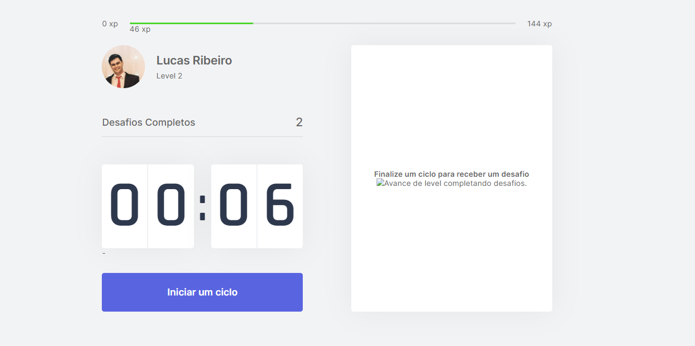
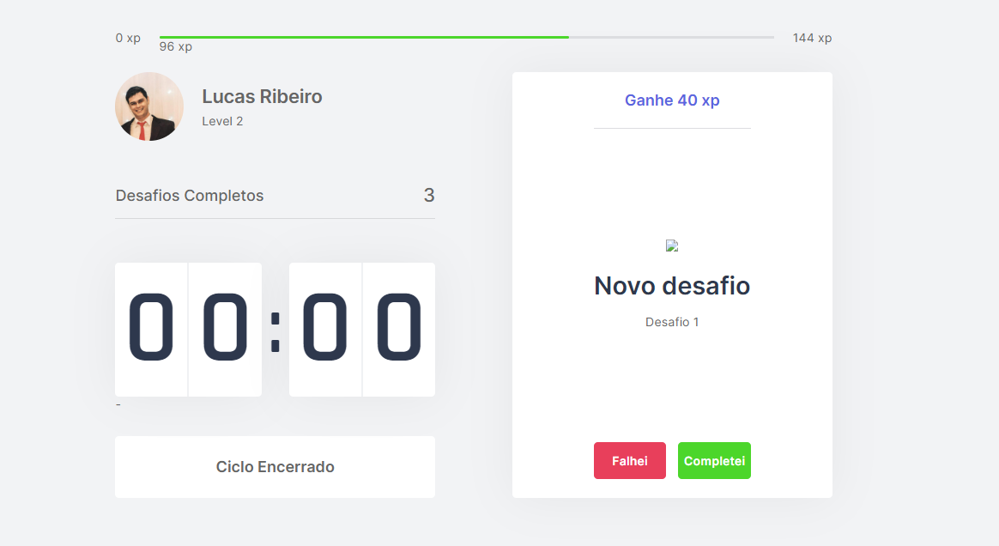
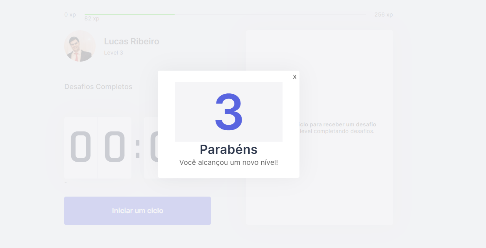

# RBN Stress

🚀 Um projeto de um site que visa auxiliar os colaboradores da empresa a realizarem exercicíos físicos durante o horário de trabalho, com a intenção de aliviar o stress diário e melhorar a produção dos mesmos! 🚀

### Pré-requisitos

Antes de começar, você vai precisar ter instalado em sua máquina as seguintes ferramentas:

Além disto é bom ter um editor para trabalhar com o código como [VSCode](https://code.visualstudio.com/)

* Realize o download do projeto

1. git clone https://github.com/lucasrp98/rbn_stress
2. cd meetapp-api

* Instale as dependência e inicialize o servidor

3. yarn install
4. yarn dev

ou 

3. npm install
4. npm dev

### 🛠 Tecnologias

As seguintes ferramentas foram usadas na construção do projeto:

- [React](https://pt-br.reactjs.org/)
- [TypeScript] (https://www.typescriptlang.org/docs/)

### Status
<h4 align="center"> 
	🚧  React Select 🚀 Concluído ...  🚧
</h4>

### Screenshots

<h1 align="center">
  
</h1>

<h1 align="center">
  
</h1>

<h1 align="center">
  
</h1>
Feito de ❤️ por Lucas Ribeiro👋🏽 Entre em contato!

<h1 align="center">
  
</h1>

   

